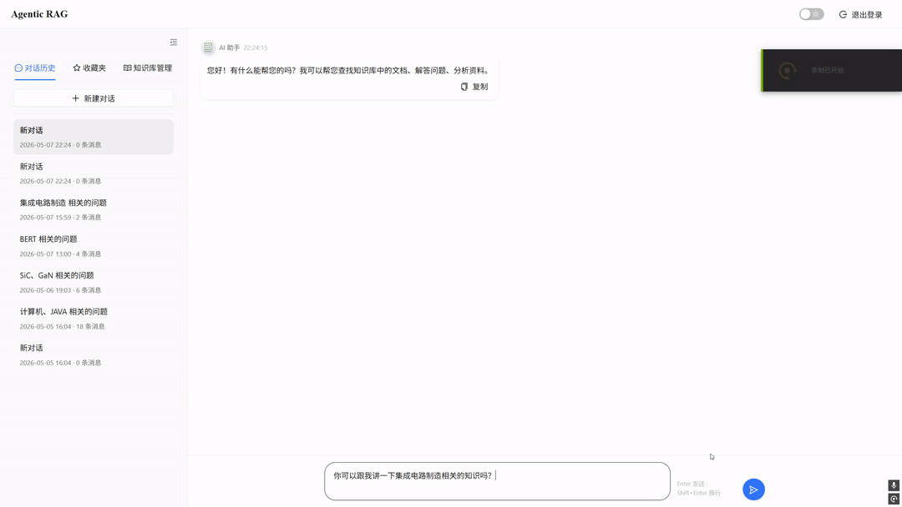

# light_rag_project

基于 LightRAG 构建的企业级 Agentic RAG 知识库系统，重点解决真实知识库落地中的四类问题：复杂问题召回不足、检索结果质量不稳定、时延与成本失控、以及调参决策缺少可重复依据。



## Overview

这个项目不是简单把 RAG 跑通，而是围绕真实工程问题做了完整落地：

- 用混合检索提升复杂问题召回
- 用 Agentic 自纠错链路改善检索质量
- 用多模型路由控制时延与成本
- 用 Benchmark 和重复实验做配置决策，而不是凭单次结果拍脑袋调参

当前仓库为了保留历史提交，项目代码位于 `LightRAG_Project/` 子目录，但仓库首页 README 只保留这一份，不再额外跳转二级 README。

## Core Capabilities

### Hybrid Retrieval

- 图谱检索与向量检索并行召回
- 图谱侧基于实体、关系链补足复杂问题的结构化线索
- 向量侧结合原始查询、改写查询与子查询补足语义覆盖
- 合并候选后统一去重、重排，再交给 LLM 生成答案

### Agentic Self-Correction Loop

- Query Resolver 负责指代消解、查询补全与复杂问题预处理
- Query Decomposer 将多意图问题拆成可独立检索的子查询
- Retrieval Grader 判断召回结果是否足够相关
- Query Rewriter 在召回不足时改写查询并重试
- Neighbor Chunk Expansion 与 rerank 共同提升最终上下文质量

### Multi-Model Routing

- 查询前先做关键词提取与复杂度分级
- 简单问题走轻量模型，压低时延与成本
- 复杂问题走更强模型和完整 Agentic 链路，保证质量
- 配置决策基于 Benchmark 和重复实验，而不是单次波动结果

### Citation Grounding

- 检索阶段注入引用锚点 `[n]`
- 生成阶段保留可追踪引用编号
- 返回前清理孤儿引用、失效编号和噪声引用块
- 前端展示真实文档名与对应原文片段

### Long-Context Memory

- 滑动窗口维护最近多轮会话连续性
- Embedding 与 BM25 混合召回历史上下文
- 滚动摘要压缩超长会话，降低上下文膨胀

### Workspace Isolation

- 按 `dept_{id}` / `user_{id}` 隔离知识空间
- 同部门共享知识库，跨部门默认隔离
- 向量、图谱、文件与缓存均按 workspace 独立管理

## Query Flow

完整问答链路可以概括为：

1. 关键词提取与复杂度分级，判断是否需要完整 Agentic 链路。
2. Query Resolver 做指代消解、查询补全和必要的查询分解。
3. LightRAG 同时执行图谱路径与向量路径召回。
4. qwen3-rerank 对候选片段重排，过滤低质量上下文。
5. Retrieval Grader 评估召回是否通过。
6. 若召回不足，则触发 Neighbor Chunk Expansion 或 Query Rewriter 重试。
7. 最终答案生成时保留引用编号，并在返回前做引用清理。

## Architecture

```text
React Frontend
	|
	v
FastAPI API Layer
	|
	+-- JWT Auth
	+-- Chat / Upload / Document APIs
	+-- Agentic RAG Orchestrator
	|
	+-- LightRAG Engine
	|     +-- Graph Retrieval
	|     +-- Vector Retrieval (Qdrant)
	|     +-- Rerank
	|
	+-- Celery Worker
	|     +-- Async Indexing
	|
	+-- Redis
	+-- MySQL
```

## Benchmark-Driven Engineering

项目内置自动化 Benchmark，用于同时评估检索质量与生成质量。

- 检索指标：chunk 命中率、召回率、精确率
- 生成指标：忠实度、回答相关性、完整性
- 评估方式：LLM-as-a-Judge
- 决策方式：重复实验 + 配置对比，而不是单次跑分

当前较优配置下：

- 37 个预设 chunk 中正确命中 33 个
- chunk 级命中率 89.2%
- 综合评测总分 87.6
- 常规问答响应时间约 10-15s
- 复杂多跳问答响应时间约 25-35s

## Tech Stack

| Layer | Tech |
|---|---|
| Frontend | React, Vite, Ant Design |
| Backend | FastAPI, SQLAlchemy, MySQL |
| Retrieval | LightRAG, Qdrant |
| Queue | Celery, Redis |
| LLM / Rerank | DashScope (Qwen series), qwen3-rerank |
| Embedding | text-embedding-v4 |

## Project Structure

```text
.
├── README.md
├── LICENSE
└── LightRAG_Project/
	├── app/
	├── frontend/
	├── benchmark/
	├── assets/
	├── main.py
	└── start-all.ps1
```

## Quick Start

### Start all services

```powershell
cd LightRAG_Project
.\start-all.ps1
```

可选命令：

```powershell
cd LightRAG_Project
.\start-all.ps1 -Flower
.\start-all.ps1 -Stop
```

### Default ports

- Backend API: `http://localhost:8000`
- Frontend: `http://localhost:5173`
- Flower: `http://localhost:5555`（可选）

## Main Entry Points

- Backend entry: `LightRAG_Project/main.py`
- Frontend app: `LightRAG_Project/frontend`
- Startup script: `LightRAG_Project/start-all.ps1`

## License

本项目遵循仓库中的 [LICENSE](LICENSE)。